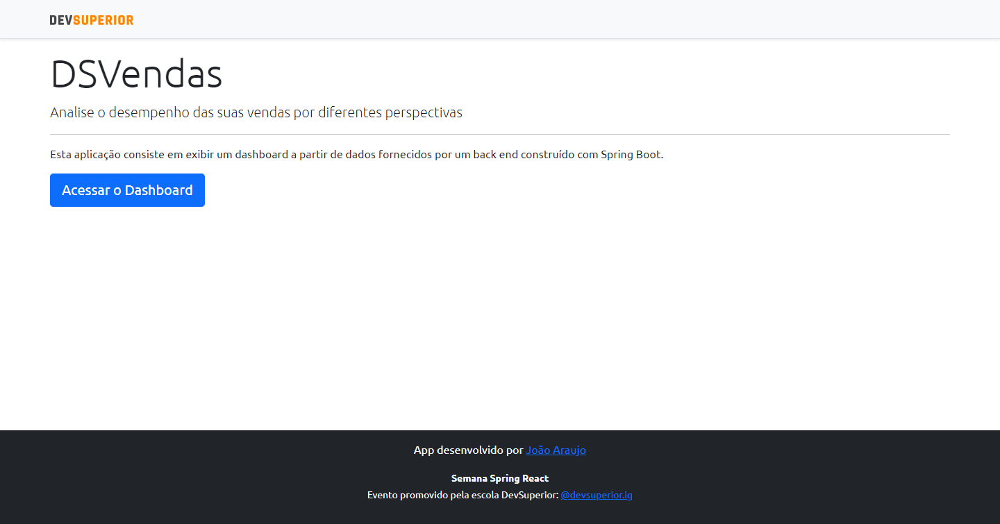
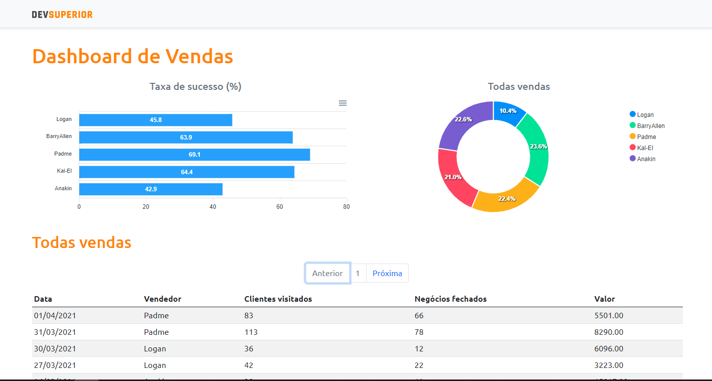

# Projeto Semana Dev Superior 3º Edição

✨ Funcionamento:
- Home com direcionamento para tela de Dashboard
- Página Dashboard com:
- BarChart (Gráfico de barras)
- DonutChart (Gráfico de rosca)
- Tabela com as informações de venda por vendedor
- Paginação dinâmica
- Aplicação responsiva

💻 Tecnologias utilizadas:
- React
- TypeScript
- Java
- Spring Boot
- Bootstrap

⚙️ Ferramentas:
- Spring Tool Suite 4
- Postgresql e pgAdmin
- Postman
- Netlify
- NPM
- Git
- Heroku CLI

